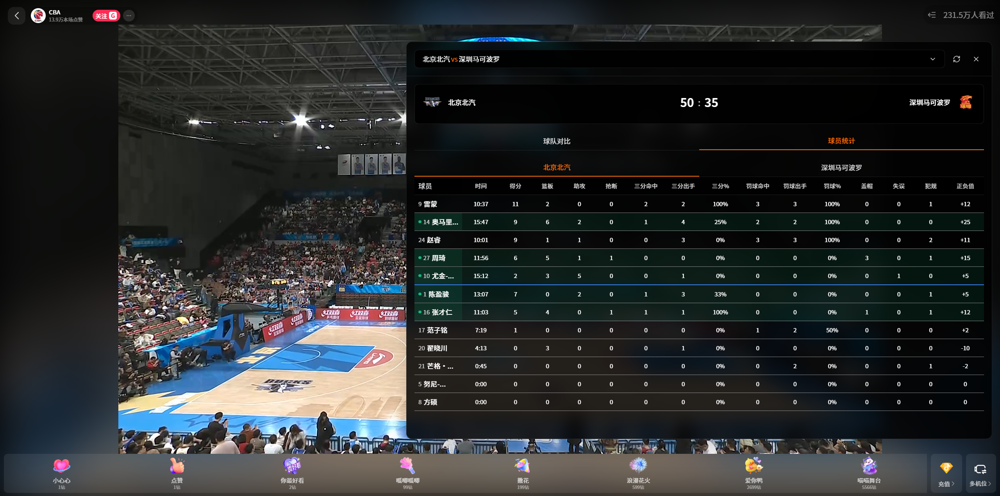

# CBA Live Insight

CBA 赛场洞察 Chrome 插件 - 在抖音网页版观看CBA直播时提供实时数据面板。

## 功能特性

- 🏀 实时比赛数据展示
- 📊 球队对比统计（投篮、三分、罚球、篮板、助攻、失误）
- 👥 球员技术统计（得分、篮板、助攻、正负值等）
- 🎯 在场球员标识
- 🔄 自动轮询更新（10秒间隔）
- 🎨 现代深色磨砂玻璃UI设计

## 技术栈

- React 18
- Vite
- Tailwind CSS
- React Query
- Lucide React (图标库)
- Chrome Extension Manifest V3

## 开发

### 安装依赖

```bash
npm install
```

### 开发模式

```bash
npm run dev
```

### 构建

```bash
npm run build
```

构建完成后，`dist` 目录即为可加载的Chrome扩展程序。

## 安装

1. 打开 Chrome 浏览器
2. 访问 `chrome://extensions/`
3. 开启右上角"开发者模式"
4. 点击"加载已解压的扩展程序"
5. 选择项目的 `dist` 目录

## 使用

1. 访问 `https://live.douyin.com/` 观看CBA直播
2. 点击页面右侧的悬浮按钮
3. 从下拉框选择当日比赛
4. 查看实时比分、球队对比和球员统计数据

## 数据接口

- 比赛列表接口：`https://vms-sc.miguvideo.com/vms-match/v6/staticcache/basic/match-list/normal-match-list/0/2221401/default/1/miguvideo`
- 统计数据接口：`https://v0-sc.miguvideo.com/vms-livedata/live-stream/v1/tech-statistic/{matchId}`

## 注意事项

- 插件仅在 `https://live.douyin.com/*` 域名下激活
- 需要网络连接以获取实时数据
- 比赛未开始时，统计数据可能不可用

## 许可证

MIT
